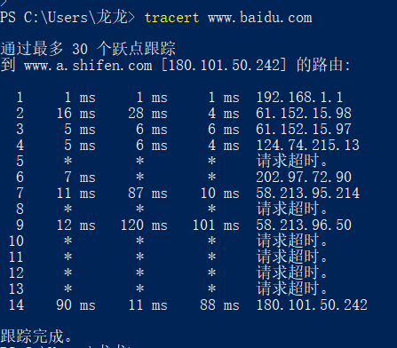

# awesome-commands
 操作系统/大语言模型上最常用的100条命令
# Windows
- [x] help, 提供windows上指令帮助
- [x] set, 设置当前的环境变量, 临时性
- [x] setx, 永久性设置环境变量
```
setx PATH "C:\Your\Path\Here;%PATH%"
注意, 添加过来的是目录路径, 譬如exe所在的目录而不是exe本身
``` 
- [x] ipconfig, 查看网络ip和dns的信息   
- [x] echo, 回声
- [x] cls, 清空当前cmd屏幕信息
- [x] ping, ip层的命令
- [x] netstat, 显示连接的TCP连接数, 计算机侦听的端口, 以太网统计信息 
- [x] nslokup, 查询域名系统(DNS)
- [x] tracert, 路由追踪

- [x] wsl, windows上的linux子系统
```
wsl --list --all
wsl --unregister Ubuntu
```
- [x] ping: 主要用于测试网络连接的可用性, 但是公司内网可能ping不通外面网站的
- [x] wget: 主要用于从web服务器下载文件, 支持多种协议和递归下载以及断点续传
- [x] netstat, 查看端口
 - [x] netstat -aon|findstr "xxxx": 查看端口xxxx有没有被占用
- [x] findstr
- [x] dir, linux上的dir  
# Linux
```
Unix
    Linux
    WSL
```

- [x] man, manual, man xxx查看xxx命令
- [x] apt
```
apt-get update # 安装依赖更新
```
- [x] ifconfig, 查网络网卡ip,dns服务器,默认路由等
- [x] tcpdump, 网络监听抓包  
- [x] ps, 查看进程, process status, ps aux可以查看所有用户的所有进程
- [x] top, top可以实时展示当前进程状态
- [x] date +%s, 用于获取当前时间的Unix时间戳（Unix timestamp）的命令, Unix时间戳是指从格林威治时间1970年1月1日00:00:00（UTC）到当前时间的总秒数
# Chatgpt
here are some awesome chatgpt prompts.\
chatgpt必须在国外的ip, 你可以让它act as...(角色扮演)\
chatgpt简直是互联网上内容的化身呀...
- [x] prompt生成器:
```
I want you to act as a prompt generator. Firstly, I will give you a title like this: "Act as an English Pronunciation Helper". Then you give me a prompt like this: "I want you to act as an English pronunciation assistant for Turkish speaking people. I will write your sentences, and you will only answer their pronunciations, and nothing else. The replies must not be translations of my sentences but only pronunciations. Pronunciations should use Turkish Latin letters for phonetics. Do not write explanations on replies. My first sentence is "how the weather is in Istanbul?"." (You should adapt the sample prompt according to the title I gave. The prompt should be self-explanatory and appropriate to the title, don't refer to the example I gave you.). My first title is "Act as a Code Review Helper" (Give me prompt only)
```
## 可用的gpt源
- [x] gtp3.5, https://poe.com/
# Git
- [ ] git add
  - [ ] git add . 将当前所有的代码修改加入暂存区 
- [ ] git commit
  - [ ] git commit -m "xxx": 提交commit, messgae是"xxx" 
  - [ ] git commit --amend: 覆盖上次的pr, 保证一次pr解决一次问题, 具有唯一的一次commit 
- [ ] git stash
 - [ ] 本地修改暂时保留 
- [ ] git pull
  - [ ] a combination of git fetch + git merge
  - [ ] git pull --rebase: git pull --rebase 会将你的本地提交应用在对应分支的远程提交之上，而不是创建一个合并提交
  - [ ] git checkout
    - [ ] git checkout -b xxx: 创建分支xxx 
    - [ ] git checkout -b xxx origin/xxx
      - [ ] 本地创建分支xxx, 该分支追踪远程origin的分支xxx
 - [ ] git reset
   - [ ] 版本回退
   - [ ] git reset --hard
    - [ ] git reset --hard <commit-hash>
    - [ ] The **git reset --hard HEAD** command would discard all uncommitted changes even if you’ve added them to the staging area.
    - [ ] https://www.freecodecamp.org/news/git-reset-hard-how-to-reset-to-head-in-git/
 - [ ] git status
   - [ ] 查看分支状态
 - [ ] git branch
   - [ ] git branch 查看本地所有分支
   - [ ] git branch -d删除, -D强烈删除
 - [ ] git push
   - [ ] git push origin xxx: 将本地的分支push到远程上去
 - [ ] git log
   - [ ] For clarity, run git log --oneline to show your commit history
  # pip
  - [ ] pip list
  - [ ] pip install xxx
   - [ ] pip install --proxy=http://xxx.yyy.zzz:ddd (公司内部代理)
   - [ ] pip install -i http://pypi.douban.com/simple/ （豆瓣源）
  # Notepad++ use
  - [ ] Ctrl+K: 默认是注释键
